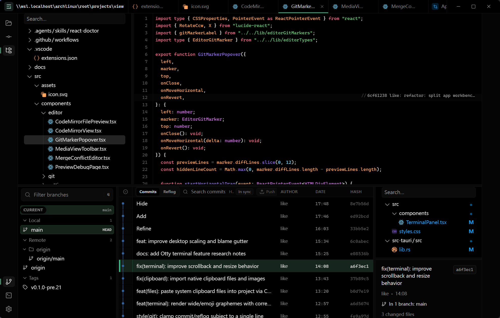

# view

`view` is a Tauri 2 desktop workbench for browsing projects, inspecting Git
history, reviewing diffs, editing files, and running an embedded terminal from
one dense desktop UI.

It is built for day-to-day repository work rather than marketing-style chrome:
fast navigation, multi-panel workflows, and native-feeling resize and drag
interactions.



## Highlights

- Rail-based workspace layout with draggable tool icons on the left and right
  rails
- File tree, Git, commit, and terminal panels that can be moved between rail
  slots
- Side-by-side workflow with editor or diff content kept in the center
- CodeMirror-based text editor with search, replace, and inline Git blame
- Git history and reflog views, including backend-powered filtering
- Commit inspection, staging, restore, and reset-to-reflog flows
- Embedded terminal powered by `alacritty_terminal`
- Multi-project switching with persisted workbench layout and panel sizes
- Works for regular folders too; Git-specific panels activate when the selected
  folder is inside a Git repository

## Stack

- Frontend: React 19 + Vite + TypeScript
- Desktop shell: Tauri 2
- Backend: Rust commands in `src-tauri/src/lib.rs`
- Data/query layer: TanStack Query
- Editor: CodeMirror 6
- Diff renderer: `@pierre/diffs`
- Tree renderer: `@pierre/trees`

## Development

### Requirements

- Bun 1.3+
- Rust stable
- Tauri 2 prerequisites for your platform

Linux dev builds also need the GTK/WebKit dependencies used in CI:

```bash
sudo apt-get install -y \
  libwebkit2gtk-4.1-dev \
  libappindicator3-dev \
  librsvg2-dev \
  patchelf \
  libssl-dev \
  libgtk-3-dev \
  libfuse2
```

### Install

```bash
bun install
```

### Common commands

```bash
# Frontend only
bun run dev

# Desktop app in development
bun run tauri:dev

# Typecheck + production frontend build
bun run build

# Rust tests
cd src-tauri && cargo test

# Build desktop release
bun run tauri:build

# Build and run the Linux release binary
just run-release
```

## Repository layout

```text
src/                     React UI, hooks, CodeMirror integration, settings
src/components/          App surfaces and workbench panels
src/components/editor/   File preview and editor-related UI
src/components/workbench/Rail slot stacks and Git panel composition
src/hooks/               Query and UI state hooks
src/lib/                 Tauri API wrappers, layout, parsing, transforms
src-tauri/src/           Rust commands, Git operations, terminal backend
.github/workflows/       CI build and release automation
```

## CI

GitHub Actions builds Linux and Windows artifacts from
[`.github/workflows/build.yml`](./.github/workflows/build.yml).

- Rust dependencies and target output are cached with
  `swatinem/rust-cache@v2`
- Bun package downloads are cached via `actions/cache@v4`
- Frontend dependencies are installed with `bun install --frozen-lockfile`

## Notes

- `src/App.tsx` is currently an orchestration-heavy shell; new feature logic is
  generally better extracted into `src/components/`, `src/hooks/`, or `src/lib/`
- Tauri command wrappers belong in `src/lib/api.ts` rather than React
  components calling `invoke` directly
- Path-sensitive Git and file operations are validated on the Rust side

## License

No license has been declared yet.
